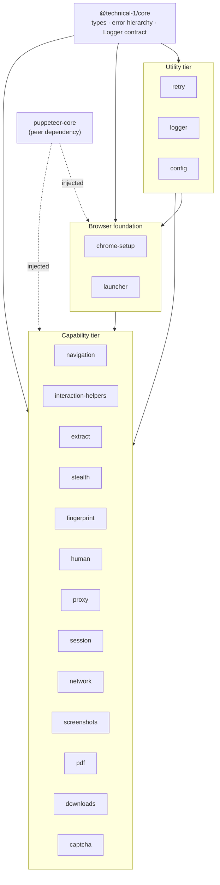

# Architecture

## System Diagram

The suite is organized as **acyclic dependency tiers**: every package depends only on packages in a tier below it, so each one is independently buildable, testable, and publishable.

## Component Descriptions

### core
- **Purpose**: The shared contract every other package agrees on — nothing more.
- **Location**: `packages/core/src/`
- **Key responsibilities**: The `PptrKitError` base class + typed subclasses (`NavigationError`, `SelectorNotFoundError`, `SessionError`, `CaptchaError`, `ProxyError`, `TimeoutError`), each carrying `retryable` + `context`; the `Logger` interface and `LOG_LEVELS`; shared option types (`LoggerOption`, etc.). It contains no runtime browser code, so most packages depend on it for *types only*.

### Utility tier — retry, logger, config
- **Purpose**: Cross-cutting helpers usable with or without a browser.
- **Location**: `packages/{retry,logger,config}/src/`
- **Key responsibilities**: `retry` provides `withRetry` (exponential backoff, jitter, `AbortSignal`, pluggable `isRetryable`); `logger` provides the two concrete `Logger` implementations (console + EventEmitter) that the `core` contract leaves abstract; `config` loads typed config from an env map.

### Browser foundation — chrome-setup, launcher
- **Purpose**: Get a Chrome binary and a managed browser.
- **Location**: `packages/{chrome-setup,launcher}/src/`
- **Key responsibilities**: `chrome-setup` resolves an existing Chrome or downloads the latest stable build (explicit pin available for reproducible installs); `launcher` provides `withBrowser` (scoped lifecycle with guaranteed cleanup) and `BrowserPool` (bounded concurrency).

### Capability tier
- **Purpose**: The actual automation verbs.
- **Location**: `packages/{navigation,interaction-helpers,extract,stealth,fingerprint,human,proxy,session,network,screenshots,pdf,downloads,captcha}/src/`
- **Key responsibilities**: navigation with retry; safe click/type/wait helpers; text/table/schema extraction; stealth plugin wiring; fingerprint generation + application; human-like timing; proxy args/auth/rotation; session capture/restore; request blocking/throttling/response capture; screenshots; PDF rendering; CDP-based download awaiting; a captcha-solver adapter interface with a reference 2captcha implementation.

## Data Flow

A typical scrape composes packages top-down:

1. `config` reads target URL / headless flag from the environment.
2. `chrome-setup` resolves or downloads a Chrome executable.
3. `launcher` opens a browser (pooled or scoped) and hands back a `Page`.
4. Anti-detection packages (`stealth`, `fingerprint`, `proxy`) prepare the page *before* navigation.
5. `navigation` drives `goto` with retry/backoff and returns the `HTTPResponse`.
6. `interaction-helpers` / `extract` / `network` do the work; `screenshots` / `pdf` / `downloads` capture output; `session` persists state.
7. A `Logger` injected at the top streams structured log events out — into a console, an EventEmitter, or a GUI panel — without any package knowing where they go.

## External Integrations

| Service | Purpose | Notes |
|---------|---------|-------|
| `puppeteer-core` | Drives Chrome via CDP | Declared as a **peer** dependency with a bounded major range; never bundled. Injected into functions so unit tests use plain mocks. |
| `@puppeteer/browsers` | Resolve/download Chrome builds | Used only inside `chrome-setup`; wraps install + stable-channel resolution. |
| 2captcha (HTTP) | Reference captcha solver | Behind the `CaptchaSolver` adapter interface, via direct `fetch` (no SDK dependency, no bundled credentials). |

## Key Architectural Decisions

### `puppeteer-core` is a peer dependency, injected — never imported as a value
- **Context**: Browser-driving packages need Puppeteer types and a `Browser`/`Page`, but bundling Puppeteer into 14 packages would mean version conflicts and duplicate installs.
- **Decision**: Declare `puppeteer-core` as a bounded `peerDependency`, import it as `import type` only, and accept the instance/`Page`/`Browser` as a function parameter.
- **Rationale**: The consumer controls the single Puppeteer version; packages stay tiny; and every browser-driving function unit-tests against a plain object mock (`{ goto: vi.fn() }`) with no real Chrome and no module mocking.

### Errors are detected by property, not `instanceof`
- **Context**: Packages ship dual ESM + CJS. A consumer can load the ESM build of one package and the CJS build of another, so `err instanceof PptrKitError` is unreliable across that boundary.
- **Decision**: Callers branch on `err.retryable === true` and `err.name`, both cross-realm-safe. External errors crossing a package boundary are re-thrown as a `core` error with an explicit `retryable` flag.
- **Rationale**: Retry logic and error handling work regardless of which module format each package was loaded as — the failure that breaks naive dual-publish libraries.

### Test-only injection seams don't leak into the public types
- **Context**: Some functions need injectable hooks (`readdir`, `stat`, a captcha `fetch`) for unit tests, but those hooks must not appear in the published `.d.ts` and pollute consumer autocomplete.
- **Decision**: The public function takes a narrow options type; a separate `…ForTesting` export takes the wider internal type. The barrel re-exports only the narrow wrapper; tests import the `…ForTesting` symbol directly from the source file.
- **Rationale**: Consumers see a clean surface; tests still drive the seams; the privacy is enforced by the published declaration, not by convention.

### The fingerprint UA tracks the live browser instead of a constant
- **Context**: A spoofed user-agent claiming Chrome 144 while the machine runs Chrome 140 is itself a detection signal, and a hardcoded version silently drifts out of date.
- **Decision**: `applyFingerprint` reads `page.browser().version()` and rewrites the UA's `Chrome/x.y.z.w` token to match the real binary (falling back silently if it can't parse), and it also overrides in-page `navigator.language(s)` to match the locale.
- **Rationale**: The spoof is always self-consistent with reality with zero maintenance — strictly stronger than syncing two hardcoded values, and it composes with `chrome-setup` installing the latest stable Chrome.

### Concurrency primitives reserve synchronously and settle waiters on teardown
- **Context**: A browser pool that does "check the count, then `await` a launch" can exceed its bound under concurrent callers (a TOCTOU race), and a naive `drain()` can abandon queued waiters forever.
- **Decision**: `BrowserPool` reserves its slot synchronously before the first `await`, rolls the reservation back on launch failure, and rejects (never abandons) queued waiters on `drain()`.
- **Rationale**: The concurrency bound holds under real load, and shutdown is deterministic — verified by tests that fire concurrent acquisitions and assert a single launch.
