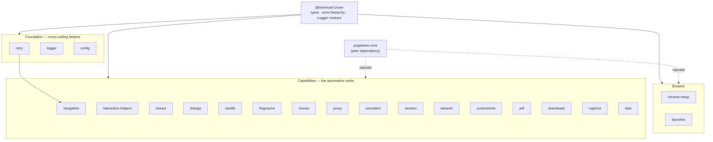

# Architecture

## The big picture

The suite is 22 small packages, and the thing that makes them pleasant to use is what they *don't* do: capability packages never depend on each other. There's a tiny shared `core` (types, the error hierarchy, the logging contract) that everything agrees on, and then each automation feature stands on its own. So installing `screenshots` never pulls in `captcha`, and you can adopt one package without buying into the whole suite.

The only build-time edges between packages are onto `core` (and `navigation` reaching for `retry`). Everything else — the `Browser`, the `Page`, `puppeteer-core` itself — is passed *in* at call time, not imported. That's what keeps each package tiny and independently versionable.

## What each tier is for

### core — the common language
- **Purpose**: The one contract every other package agrees on, and nothing more.
- **Location**: `packages/core/src/`
- **What's inside**: The `PptrKitError` base class and its typed subclasses (`NavigationError`, `SelectorNotFoundError`, `SessionError`, `CaptchaError`, `ProxyError`, `TimeoutError`, `ConfigError`, `PoolError`, `DownloadError`, `NetworkError`, `AbortError`), each carrying a `retryable` flag and structured `context`; the `Logger` interface and `LOG_LEVELS`; and shared option types. It has zero runtime browser code — most packages depend on it for *types only*.

### Foundation — retry, logger, config
- **Purpose**: Cross-cutting helpers that work with or without a browser.
- **Location**: `packages/{retry,logger,config}/src/`
- **What's inside**: `retry` gives you `withRetry` (exponential backoff, jitter, `AbortSignal`, pluggable `isRetryable`); `logger` provides two ready-made `Logger` implementations — console and EventEmitter — that fill in the abstract `core` contract; `config` loads typed configuration from an environment map with schema and defaults.

### Browser — chrome-setup, launcher
- **Purpose**: Get a Chrome binary, and get a managed browser.
- **Location**: `packages/{chrome-setup,launcher}/src/`
- **What's inside**: `chrome-setup` resolves an existing Chrome or downloads the latest stable build (with an explicit pin available for reproducible installs); `launcher` gives you `withBrowser` (scoped lifecycle with guaranteed cleanup) and `BrowserPool` (bounded concurrency).

### Capabilities — the automation verbs
- **Purpose**: The things you actually came here to do.
- **Location**: `packages/{navigation,interaction-helpers,extract,dialogs,stealth,fingerprint,human,proxy,emulation,session,network,screenshots,pdf,downloads,captcha,tabs}/src/`
- **What's inside**: navigation with retry and SPA network-idle waiting; safe click/type/wait/scroll helpers; text/table/schema extraction; automatic JS dialog handling; stealth plugin wiring; fingerprint generation and application; human-like timing; proxy args/auth/rotation; device and viewport emulation; session capture and restore; request blocking, response capture, and throttling; screenshots; PDF rendering; CDP-based download awaiting; a captcha-solver adapter (with a reference 2captcha implementation); and popup/new-tab coordination.

## How a job flows through it

A typical scrape composes packages top to bottom:

1. `config` reads the target URL and headless flag from the environment.
2. `chrome-setup` resolves or downloads a Chrome executable.
3. `launcher` opens a browser (scoped or pooled) and hands you a `Page`.
4. Anti-detection packages (`stealth`, `fingerprint`, `emulation`, `proxy`) prepare the page *before* navigation.
5. `navigation` drives `goto` with retry/backoff and returns the `HTTPResponse`.
6. `interaction-helpers`, `extract`, and `network` do the work; `screenshots`, `pdf`, and `downloads` capture output; `session` persists state.
7. A `Logger` injected at the top streams structured events out — to a console, an EventEmitter, or a GUI — without any package knowing where they land.

## What it talks to on the outside

| Service | Purpose | Notes |
|---------|---------|-------|
| `puppeteer-core` | Drives Chrome via the DevTools Protocol | A **peer** dependency with a bounded range; never bundled. Injected into functions so unit tests use plain mocks. |
| `@puppeteer/browsers` | Resolve/download Chrome builds | Used only inside `chrome-setup`; wraps install and stable-channel resolution. |
| 2captcha (HTTP) | Reference captcha solver | Behind the `CaptchaSolver` adapter interface, via direct `fetch` — no SDK dependency, no bundled credentials. |

## The decisions that shape it

### `puppeteer-core` is a peer dependency, injected — never imported as a value
- **The problem**: Browser-driving packages need Puppeteer's types and a `Browser`/`Page`, but bundling Puppeteer into a dozen-plus packages would mean version conflicts and duplicate installs.
- **What it does**: Declares `puppeteer-core` as a bounded `peerDependency`, imports it as `import type` only, and accepts the instance/`Page`/`Browser` as a function parameter.
- **Why it's nice**: You control the single Puppeteer version, the packages stay tiny, and every browser-driving function unit-tests against a plain object mock (`{ goto: vi.fn() }`) — no real Chrome, no module mocking.

### Errors are detected by property, not `instanceof`
- **The problem**: Packages ship dual ESM + CJS. Load the ESM build of one and the CJS build of another, and `err instanceof PptrKitError` quietly stops working across that boundary.
- **What it does**: Callers branch on `err.retryable === true` and `err.name`, both of which are safe across module realms. Errors from outside (filesystem, network, `@puppeteer/browsers`) are re-thrown as `core` errors with an explicit `retryable` flag at every package boundary.
- **Why it's nice**: Retry logic and error handling keep working no matter which module format each package loaded as — the exact thing that breaks naive dual-published libraries.

### The fingerprint's user-agent tracks the real browser
- **The problem**: A spoofed user-agent claiming Chrome 144 while the machine runs Chrome 140 is *itself* a detection signal, and a hardcoded version silently drifts stale.
- **What it does**: `applyFingerprint` reads `page.browser().version()` and rewrites the UA's `Chrome/x.y.z.w` token to match the real binary (falling back quietly if it can't parse), and overrides in-page `navigator.language(s)` to match the locale.
- **Why it's nice**: The spoof stays self-consistent with reality with zero maintenance, and it composes with `chrome-setup` keeping Chrome current.

### The browser pool holds its bound under real load
- **The problem**: A pool that does "check the count, then `await` a launch" can blow past its limit when several callers hit it at once, and a naive shutdown can strand queued waiters forever.
- **What it does**: `BrowserPool` reserves its slot synchronously before the first `await`, rolls the reservation back if the launch fails, and rejects (never abandons) queued waiters on `drain()`.
- **Why it's nice**: The concurrency limit actually holds, and shutdown is deterministic — verified by tests that fire concurrent acquisitions and assert a single launch.
</content>
